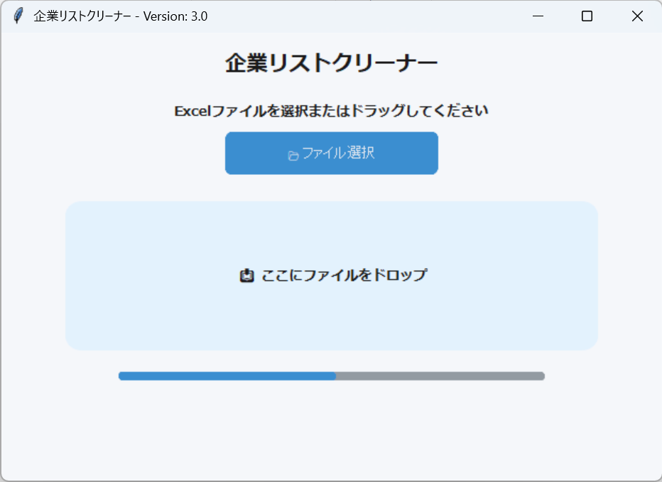

# 企業リストクリーナー (Company Cleaner)

Excelの企業リストを整理・クリーニングする社内向けツールです。  
Đây là công cụ nội bộ dùng để làm sạch và xử lý danh sách công ty trong Excel.

---

## 📸 Demo

---

# 📌 主な機能 / Tính năng chính

本ツールでは、以下の処理を自動で実行します。  
Công cụ tự động thực hiện các chức năng sau.

---

## ✅ 会社名の正規化 / Chuẩn hóa tên công ty

- `/xxxx` の削除  
  → Xóa phần `/xxxx`

- 全角 → 半角変換（ＡＢＣ → ABC）  
  → Chuyển ký tự full-width sang half-width

- 不要なスペース削除  
  → Xóa khoảng trắng dư

---

## ✅ 重複企業の削除 / Xóa công ty trùng lặp

- 会社名ベースで重複を判定  
  → Xóa dữ liệu trùng dựa trên tên công ty

---

## ✅ ブラックリストチェック / Kiểm tra blacklist

- blacklist.xlsx と照合して除外  
  → So sánh với file blacklist và loại bỏ khỏi danh sách

- 過去に対応不要と判断された企業を自動除外  
  → Tự động loại bỏ những công ty không cần xử lý

---

## ✅ Excelフォーマット維持 / Giữ nguyên định dạng Excel

以下の情報を保持します。  
Giữ nguyên các định dạng của file Excel.

- 列幅 / Độ rộng cột
- 色 / Màu sắc
- レイアウト / Layout

---

## ✅ ログ出力 / Xuất log

削除されたデータを理由付きで出力します。  
Xuất danh sách dữ liệu bị xóa kèm lý do.

---

## ✅ 出力ファイルを直接オープン / Mở trực tiếp file kết quả

処理完了後、表示されたパスをクリックするとExcelファイルを直接開けます。  
Sau khi xử lý xong, có thể click vào đường dẫn để mở trực tiếp file Excel.

---

## 📦 ダウンロード

👉 https://github.com/anhpham9/company_cleaner-tool/releases/latest

---

## 🖥️ 使用方法

[Usage Guide](usage.md) を参照してください。

---

## 🔧 開発者向け

[Developer Guide](dev.md) を参照してください。
