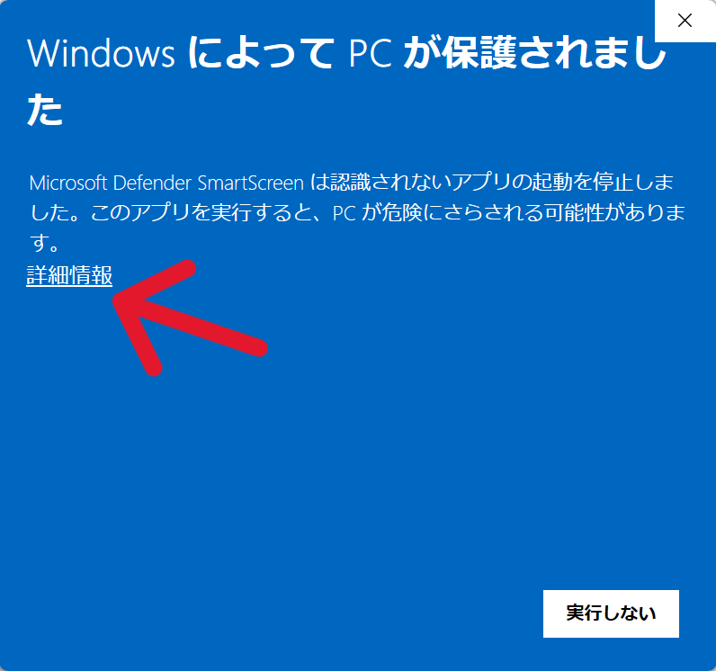
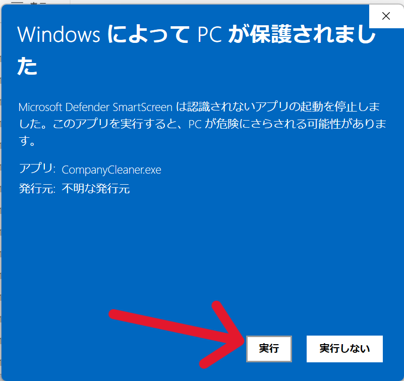

# 使用ガイド

## 📋 準備ファイル

### 📄 ブラックリスト

- ファイル名：`blacklist.xlsx`
- `.exe`ファイルと同じフォルダに配置してください
- 必須列：
  - `会社名`

---

### 📄 会社名リスト（Excelファイル）

- ファイル名：任意
- 配置場所：任意
- 必須列：
  - `会社名`

---

## 🤖 実行方法

### 方法①：ドラッグ＆ドロップ

1. アプリを起動
2. Excelファイルをドラッグ＆ドロップ
3. 自動で処理開始

---

### 方法②：ファイル選択

1. 「ファイル選択」ボタンをクリック
2. Excelファイルを選択
3. 処理完了

---

## 📂 出力ファイル

- 出力場所：
  - 元のExcelファイルと同じフォルダ
- 以下の2ファイルが出力されます：
  - `_cleaned.xlsx`
  - `_log.xlsx`

---

## ⚠️ 注意事項 / Lưu ý

* `.xlsx` ファイルのみ対応
  → Chỉ hỗ trợ file `.xlsx`

* 初回起動時にWindows警告が表示される場合があります

  → Có thể xuất hiện cảnh báo Windows khi chạy lần đầu

「詳細情報」→「実行」を選択してください。

Hãy chọn “More info” → “Run anyway”.

---

## 🚀 概要

[About App](../README.md) を参照してください。

---

## 🔧 開発者向け

[Developer Guide](dev.md) を参照してください。